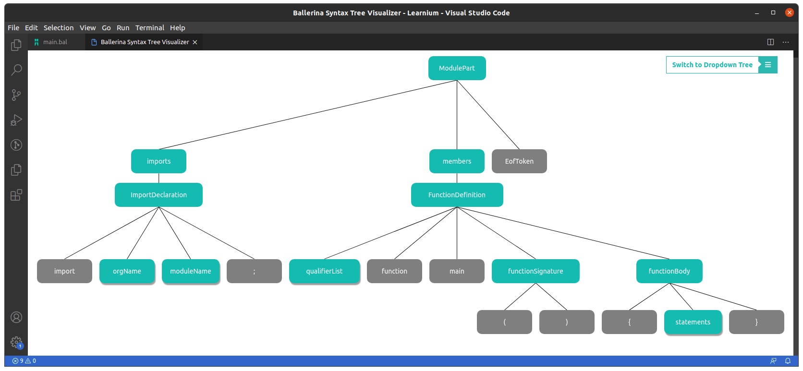
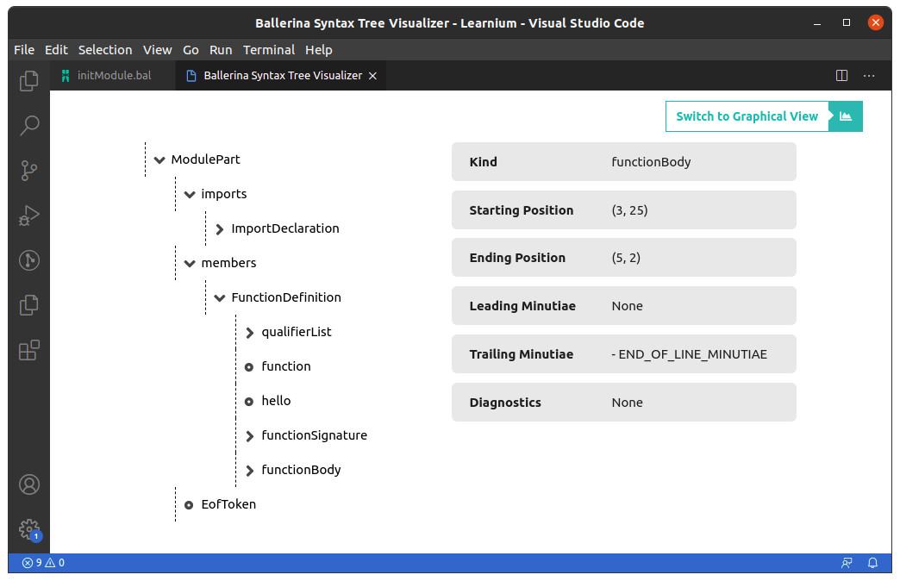
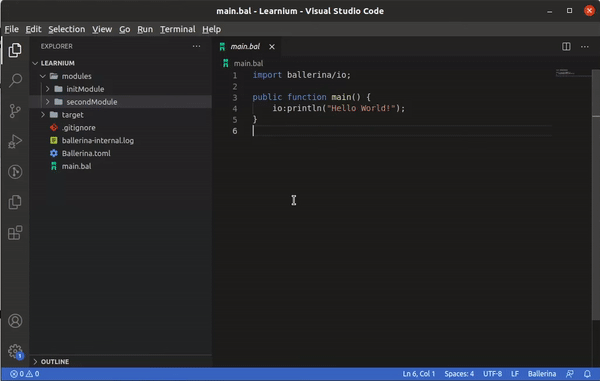
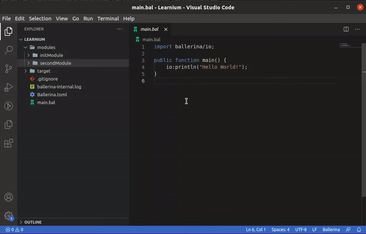
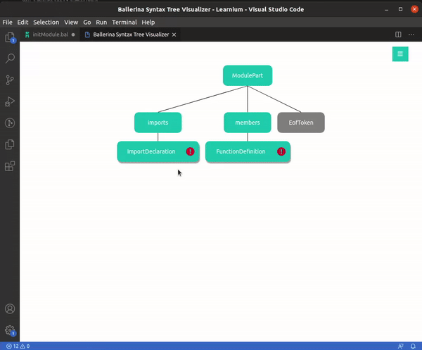

# The Ballerina Compiler Toolkit

This toolkit only provides additional tooling support for Ballerina developers. In order to experience language intelligence and other core features, install the Ballerina plugin. Checkout [ballerina.io](https://ballerina.io/) for details.

## Building the Extension
> Building with Tests
* If you want to build the VSIX of the extension with the tests, you need to:
    - Copy a released Ballerina distribution to a new "extractedDistribution" folder in the project root
    - Note that the copied distribution has to be of a version later than SwanLake Alpha4
    - Run a ```./gradlew build``` from the project root

> Building without Tests
* If you want to build the VSIX of the extension without the tests, you can run a ```./gradlew build -x test``` from the project root


## Ballerina Syntax Tree Visualizer
> To generate the syntax trees for any Ballerina source code, usuing which developers can get an simplified representation of their code blocks for easier analysis.

### The capabilities of the visualizer are in 3 main forms.
* Generate the full syntax tree of a Ballerina source file    
* Generate the subtree of the syntax tree for a particular block of code
* Locate a particular piece of code on the full syntax tree

### These tree representations can be viewed in two forms.
* The Graphical Representation
    - 
* The Dropdown Representation
    - 

### Basic Usage

The command for the full syntax tree retrieval can be found on the Command Palette.
- 

The sub syntax tree retrieval and locate code options can be found as Code Actions.
- 

### Features
> The syntax trees rendered through the visualizer have muliple features.
* Full collapsibility
    - 
* View node details
    - 
* Track syntax diagnostics
    - 
* Locate the tree node on the text editor
    - 
* Switch to full tree mode from sub syntax trees and locate trees
    -     

*All of these features are available in the Dropdown Representation as well.*
