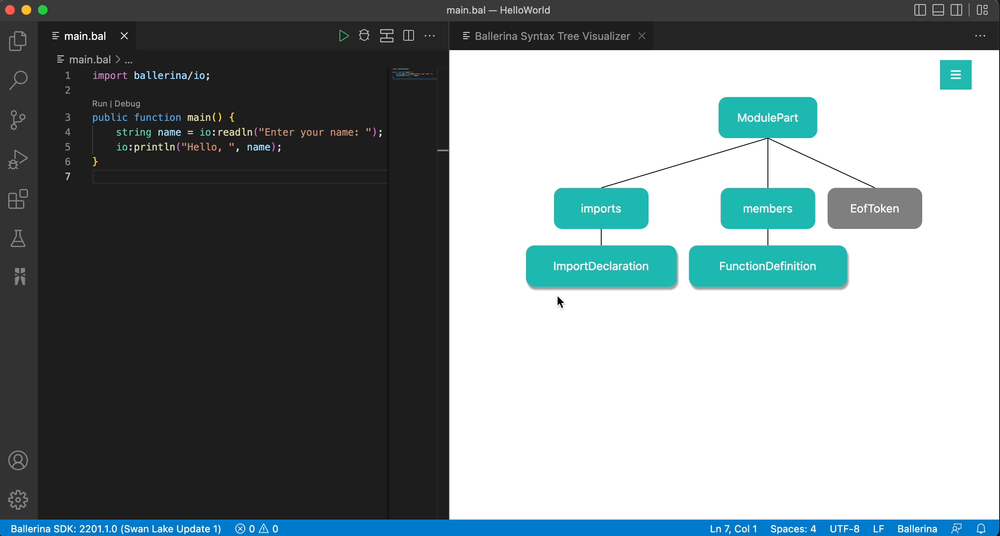

# The Ballerina Compiler Toolkit for Visual Studio Code

This toolkit introduces the capability to investigate and delve in to the syntax trees of Ballerina source code and to retrieve the Syntax API calls that are required to create the particular Ballerina source code. Hence, this extension only provides additional capabilities to support Ballerina developers. In order to experience language intelligence and other core features, install the Ballerina extension. Checkout the [Visual Studio Marketplace](https://marketplace.visualstudio.com/items?itemName=WSO2.ballerina) for the further details.

---
## Quick Start

### Setting up the Prerequisites

Before getting started, make sure you have installed the [Visual Studio Code editor](https://code.visualstudio.com/download).

### Installing the Ballerina Compiler Toolkit Extension

Follow the steps below to install the Ballerina extension.

1. Download and install [Ballerina](https://ballerina.io/learn/installing-ballerina/setting-up-ballerina/).
2. Install the [Ballerina Extension](https://ballerina.io/learn/tooling-guide/visual-studio-code-extension/quick-start/#installing-the-ballerina-extension). 

  >**Tip:** Alternatively, click `Ctrl + P` or (`Cmd + P` in macOS) to launch the VS Code **Quick Open** screen, and enter `ext install WSO2.ballerina` to install the Ballerina VS Code Extension.

3. Install the [Ballerina Compiler Toolkit Extension](https://marketplace.visualstudio.com/items?itemName=ballerina.ballerinacompilertoolkit) from the VSCode marketplace.

  >**Tip:** Similarly, you can launch the VS Code **Quick Open** screen, and enter `ext install ballerina.ballerinacompilertoolkit` to install the Compiler Toolkit Extension.

4. Open a Ballerina `.bal` file to activate the extension.

---
## Capabilities

### 1. Ballerina Syntax Tree Visualizer
The compiler toolkit includes the capabilities to generate the syntax trees for any Ballerina source code, using which developers can retrieve a simplified representation of their code blocks for convenient analysis.

#### The capabilities of the visualizer are in 3 main forms.
* Generate the complete syntax tree of a Ballerina source file    
* Generate the subtree of the syntax tree for a particular block of code
* Locate a particular piece of code on the complete syntax tree

 Representations 

##### 1. The Graphical Representation

##### 2. The Dropdown Representation

 Basic Usage 

The command for the full syntax tree retrieval can be found on the Command Palette that can be viewed via `Ctrl + Shift + P` or (`Cmd + Shift + P` in macOS).

The sub syntax tree retrieval and locate code options can be found as Code Actions.

 Features 

The syntax trees rendered through the visualizer have muliple features available in both the graphical and dropdown representations.

#### View node details

#### Track syntax diagnostics

#### Locate the tree node on the text editor

#### Switch to full tree mode from sub syntax trees and locate trees

 

### 2. Syntax API Quoter
The Ballerina syntax API quoter lists the API calls required to create the particular source code's syntax tree. Hence, its capabilities can be leveraged by any developer who uses the Ballerina syntax API to create source code elements.

 Basic Usage 

The command for the syntax API quoter can be found on the Command Palette that can be viewed via `Ctrl + Shift + P` or (`Cmd + Shift + P` in macOS). Executing this command will copy the list of syntax API calls that are required by the Ballerina source code, to the clipboard.

---
## Ask for Help

Create [Github issues](https://github.com/ballerina-platform/plugin-vscode-compiler-toolkit) to reach out to us.
